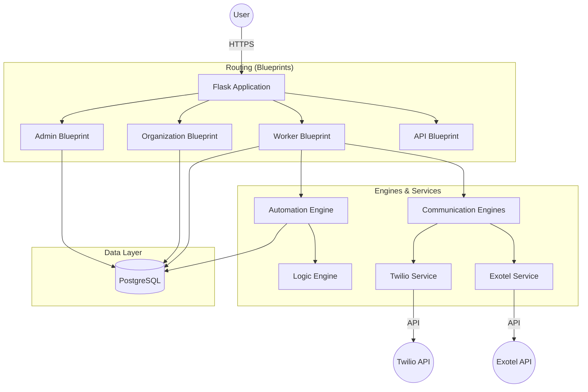
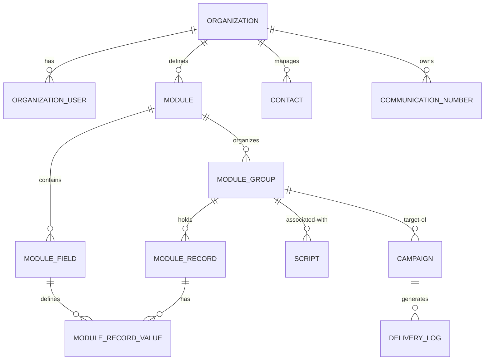

# Software Report: Customer Care Platform

## 1. Executive Summary
The Customer Care Platform is a versatile, multi-tenant SaaS application designed to streamline customer engagement and data management for organizations. By combining dynamic data modeling with advanced communication tools (WhatsApp and Voice), it provides a unified solution for businesses to manage their operations and reach their clients effectively.

## 2. System Architecture
The application follows a modular monolith architecture, utilizing Flask Blueprints to isolate different functional areas of the platform.

### Key Components:
- **Logic Engine**: Evaluates python-like expressions for dynamic fields.
- **Automation Engine**: Handles record-level recalculations and triggers.
- **Communication Dispatchers**: Abstracted services for sending messages and making calls.

## 3. Feature Breakdown

### 🛡️ Platform Administration (Super Admin)
- **Centralized Dashboard**: Oversight of all active and pending organizations.
- **Org Lifecycle Management**: Approval, suspension, and deletion of tenants.
- **Provider Configuration**: Management of platform-wide and organization-specific Twilio/Exotel credentials.
- **Commercial Management**: Configuration of subscription plans and payment methods.

### 🏢 Organization Management (Tenant Admin)
- **Role Control**: Management of worker accounts and their access.
- **Branding**: Customization of organization profile and contact information.
- **Billing**: Interface for plan upgrades, payment processing, and usage tracking.
- **Number Provisioning**: Requests for dedicated WhatsApp or Voice numbers.

### 👥 Worker Functionality
- **Dynamic Modules**: Creation of custom data structures (Modules) with specific fields (Fields) and groupings (Groups).
- **Data Operations**: CRUD operations on records, template-based imports, and data exports.
- **Scripting System**: Multi-language script management with support for placeholders.
- **Campaign Execution**: Targeted outreach via WhatsApp (Text/Voice) and automated calls.

## 4. Database Schema
The database is designed for flexibility, using a "Meta-Model" approach for dynamic modules.

## 5. Technology Stack

| Layer | Technology |
| :--- | :--- |
| **Framework** | Flask (Python) |
| **ORM** | SQLAlchemy |
| **Database** | PostgreSQL / SQLite |
| **Communication** | Twilio API (WhatsApp/Voice), Exotel |
| **AI/Audio** | gTTS (Google Text-to-Speech), DeepL/Translator |
| **Migrations** | Flask-Migrate (Alembic) |
| **Security** | Flask-Login, CSRF Protection, Werkzeug Hashing |

## 6. Design Philosophy
- **Dynamic Growth**: Instead of static tables, the "Module" system allows organizations to build their own CRM/ERP-like structures.
- **Tenant Isolation**: Every database query is scoped to the `organization_id` to ensure absolute data privacy.
- **Resilient Communication**: Communication tasks are handled with error logging and retry awareness (via delivery logs).
